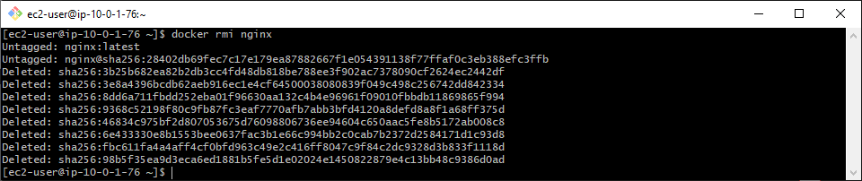

This repository is for hands-on practice of the ['Docker Containers and Kubernetes Fundamentals – Full Hands-On Course' from YouTube](https://www.youtube.com/watch?v=kTp5xUtcalw)
#

Installing Docker
```bash
sudo dnf install -y docker
```

Checking Docker Service Status
```bash
sudo systemctl status docker
```

Starting Docker Service
```bash
sudo systemctl start docker
```

Enabling Docker Service on Boot
```bash
sudo systemctl enable docker
```

Adding User to Docker Group
```bash
sudo usermod -aG docker ec2-user
```

Refreshing Group Membership
```bash
newgrp docker
```

Retrieving Docker System Information
```bash
docker info
```

Checking Docker Version
```bash
docker version
```

---

## Nginx

Pull and run a Nginx server
```bash
docker run -d -p 8080:80 --name webserver nginx
```

<div align="center">
  
</div>

#

List the running containers
```bash
docker ps
```
List the images
```bash
docker images
```

<div align="center">
  
</div>

#

Root access to the Nginx container
```bash
docker container exec -it webserver bash
```
Stop the container
```bash
docker stop webserver
```

<div align="center">
  
</div>

#

Remove the container from memory
```bash
docker rm webserver
```

<div align="center">
  
</div>

#

Remove the image
```bash
docker rmi nginx
```

<div align="center">
  
</div>
